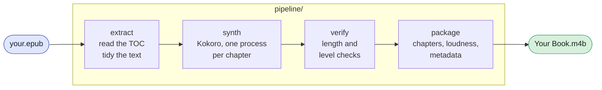

<h1>Tome Raider</h1>

**Your books. Out loud. No cloud.**

Drop an EPUB in, get a chaptered `.m4b` back. Everything happens on your
laptop.


```bash
mkdir -p books/my-book/book
cp mybook.epub books/my-book/book/
python pipeline/run.py
```

That's the whole interface. Go make tea; it'll be a chaptered audiobook when
you get back.

---

## Why this exists

You own the book. You'd listen to it if somebody had bothered to record it.
Nobody did, or they did and it costs another twenty quid, or it exists but
only in a format that phones home about what page you're on.

So: a small model, your own CPU, and about forty minutes per three hours of
audiobook.

## Why Kokoro

Most modern text-to-speech works like a language model, predicting audio one
token at a time. That's how they clone a voice from five seconds of you, and
it's also how they occasionally wander off, repeat a clause, or quietly drop
a sentence somewhere in hour nine.

[Kokoro](https://huggingface.co/hexgrad/Kokoro-82M) works differently. It
figures out how long everything should take, then renders it in one pass.
What's on the page is what comes out, chapter one to chapter forty. Its
voices are frozen tensors, so the narrator you start with is the narrator you
finish with.

Voice cloning lives in a different kind of model. This one arrives with 54
voices and gets straight to work, at 82M parameters, on a laptop, several
times faster than real time.

## Getting started

You need Python 3.10+, plus two things pip has opinions about but won't
install:

```bash
brew install espeak-ng ffmpeg          # macOS
sudo apt install espeak-ng ffmpeg      # Debian/Ubuntu
```

`espeak-ng` turns letters into phonemes, which is the only thing Kokoro
understands. `ffmpeg` does the final encode.

```bash
git clone <this repo> && cd tome-raider
python3 -m venv .venv
.venv/bin/pip install -r requirements.txt
```

Then feed it a book:

```bash
mkdir -p books/my-book/book
cp ~/Downloads/mybook.epub books/my-book/book/
python pipeline/run.py
```

Output lands in `books/my-book/audiobook/`. Run it again with a second book
in place and it picks up whatever hasn't been made yet.

## What happens inside



Each stage runs on its own if you'd rather drive manually. Everything is
resumable: finished chapters stay finished, and a chapter interrupted
halfway leaves a `.part` file that the next run knows to redo.

## The two minutes that save you three hours

### Look at what it plans to read

```console
$ python pipeline/extract.py my-book

my-book
  00_prologue.txt            1696 words  | Prologue.
  01_ch01.txt               10173 words  | Chapter One. The Arrival.
  02_ch02.txt               11725 words  | Chapter Two. What Came Before.
  03_ch03.txt               12316 words  | Chapter Three. The Long Winter.
  04_epilogue.txt            3025 words  | Epilogue.
  5 sections, 38935 words, ~4.3 h
```

Chapter order and titles come from the book's own table of contents, and
anything the TOC leaves out gets treated as front matter. That one rule
quietly disposes of covers, adverts, newsletter signup pages and navigation
stubs across most publishers. Indexes, bibliographies and lists of
illustrations go too.

Glance at the list. If something's missing or something odd survived, a
`skip` or `keep` regex in `book.json` sorts it.

### Listen to how it'll say the names

Kokoro never sees your letters, only phonemes, so an unfamiliar name gets
sounded out from English spelling rules. English spelling rules being what
they are, this goes about as well as you'd expect:

```console
$ python pipeline/probe_names.py my-book

142 names to review (0 already in the lexicons)

  38x  Featherstonehaugh        fˈɛðəɹstˌOnhɔ
  21x  Beauchamp                bˈOʧæmp
  14x  Okonkwo                  ɑkˈɔŋkwO
   9x  Siobhan                  ʃɪvˈɔn
```

Two of those are fine. The other two are "FEATH-er-stone-haw" and
"BOH-champ", and anyone who has met an English surname knows they should be
**FAN-shaw** and **BEECH-am**.

Teach it, once:

```tsv
Featherstonehaugh	fˈænʃɔ	FAN-shaw
Beauchamp	bˈiʧəm	BEECH-am
```

```
lexicon/*.tsv               every book you ever convert
books/<slug>/lexicon.tsv    just this one
```

The third column is a note to yourself in whatever spelling makes sense —
the pipeline ignores it, and it's what lets you review the file six months
later without deciphering IPA. Kokoro's vowels: `A`=ay, `I`=eye, `O`=oh,
`W`=ow, `Y`=oy. `lexicon/shared.tsv` has the full tour.

Names repeat. One line here often fixes several hundred utterances.

## Settings

`book.json` is optional — title, author and year come from the EPUB unless
you'd rather they didn't.

```json
{
  "title": "Book Title",
  "author": "Author Name",
  "year": "2020",
  "voice": "af_heart",
  "speed": 1.0,
  "skip": ["^appendix"],
  "keep": [],
  "strip_tables": true,
  "require_toc": true,
  "append": {"ch10": "Text spoken at the end of this section."}
}
```

| key | what it does |
|---|---|
| `title` `author` `year` | metadata your player shows |
| `voice` | any Kokoro voice id |
| `speed` | 1.0 lands around normal audiobook pace |
| `skip` / `keep` | regexes against TOC titles; `keep` wins |
| `strip_tables` | tables read as a wall of loose words, so they're dropped |
| `require_toc` | treat anything the TOC omits as front matter |
| `append` | extra text spoken at the end of a section, for a footnote worth hearing |

**Voices.** `af_heart` is the default and the best-graded of the set;
`af_bella` is the closest alternative and `bm_fable` reads British. The
model's
[VOICES.md](https://huggingface.co/hexgrad/Kokoro-82M/blob/main/VOICES.md)
grades all 54.

## Checking the result

```console
$ python pipeline/verify.py my-book

my-book
  section                     words   actual   expect   wpm  peak  status
  00_prologue                  1701     645s     646s   158  0.78  ok
  01_ch01                     10178    3870s    3866s   158  0.87  ok
  02_ch02                     11730    4404s    4456s   160  0.98  ok
  03_ch03                     12319    4656s    4679s   159  0.88  ok
  04_epilogue                  3030    1179s    1151s   154  0.76  ok
  5 sections, 4.13 h, 158 wpm, 0 needing a listen
```

Every chapter gets measured against its own word count, calibrated to the
book's natural pace. A chapter that came up short shows here rather than in
your ears at bedtime.

For a closer look at where chunks were stitched together:

```console
$ ffmpeg -ss 00:30:00 -t 00:20:00 -i book.m4b -ar 24000 -ac 1 /tmp/x.wav
$ python pipeline/inspect_joins.py /tmp/x.wav

x.wav: 20.0 min, 325 pauses
  median 0.46s  p90 0.83s  max 1.82s
  1 pauses over 1.8s (3.0 per hour)
  0 pauses with >12 dB level step across them
```

Healthy output looks like the pauses the pipeline meant to put there and
very little else.

After that it's over to your ears. Give a few minutes of a long chapter a
listen before you commit an evening to it — a machine can measure where the
seams are, and you can hear whether they land somewhere graceful.

## FAQ

**Can it read in my voice?**
Not this model — Kokoro's voices are fixed, which is the same property that
keeps the narrator steady across a fourteen-hour book. If your heart is set
on it, render with Kokoro and run the output through a voice-conversion
model afterwards; that keeps the steady delivery and swaps the timbre.

**How long does a book take?**
Several times faster than real time on a recent laptop. A three-hour
audiobook lands in well under an hour.

**Do I need a GPU?**
No. 82M parameters is small enough that CPU is genuinely fine.

**Windows?**
The Python side is portable, but the paths and the `brew`/`apt` instructions
assume macOS or Linux. WSL is the easy route; a native port would be a
welcome PR.

**Other languages?**
Kokoro speaks eight. This pipeline currently talks American English, and its
text tidying assumes it. Opening that up is a genuinely good first
contribution — see below.

**PDFs? MOBI? AZW3?**
EPUB today. Calibre converts most things to EPUB in one command, which is
the pragmatic route.

**Is this legal?**
Converting a book you own, for yourself, is the same shape as ripping a CD
you own. Handing the result around is a different thing entirely, and the
copyright in the text stays exactly where it was.

**It slowed to a crawl halfway through a long book.**
A stalled render keeps going, just far too slowly, and it doesn't pick itself
back up. `synth.py` watches each chapter's output rate and restarts one
that's fallen behind; thresholds are at the top of the file. If it keeps
happening, look at free memory — Kokoro wants a decent working set, and
things get sticky once the machine starts swapping.

**Nothing came out of `extract.py`.**
The EPUB's table of contents is probably missing or malformed. Set
`"require_toc": false` and let the skip list do the work instead.

**I added a lexicon entry and the name is still wrong.**
Entries match whole words, case-insensitively, and handle possessives — but
not across hyphens or inside longer words. Re-run `probe_names.py`; it hides
names already covered, so anything still listed hasn't matched yet.

## Contributing

Small and welcome:

- **A lexicon entry.** Ran into a name Kokoro mangles? Add it to
  `lexicon/shared.tsv` with the sound written out in the third column, and
  everyone's next book benefits.
- **A publisher that extracts badly.** If a book comes out with adverts
  narrated or chapters missing, that's a rule worth adding. The interesting
  part is the EPUB's structure, not the book itself.

Bigger and also welcome:

- **Another language.** `lang_code` is pinned to American English in a
  handful of places, and `extract.py`'s normalisation rules are
  English-shaped. Both are tractable.
- **Windows support.** Mostly paths and install docs.
- **Better chunking.** Chunks currently aim for the 100–200 phoneme window
  the model card recommends, split on sentence boundaries. Clause-aware
  splitting could make the seams sit better.

Run `pipeline/verify.py` on a book before and after any change to the audio
path — it catches the failures that are otherwise silent.

## Licence

MIT, see [LICENSE](LICENSE).

Kokoro-82M and misaki are Apache-2.0 by
[hexgrad](https://github.com/hexgrad/kokoro), who deserve the credit for the
part of this that's actually hard. `espeak-ng` and `phonemizer` are GPL-3.0
and get installed separately.

Nothing here grants you any rights in the books you convert.
